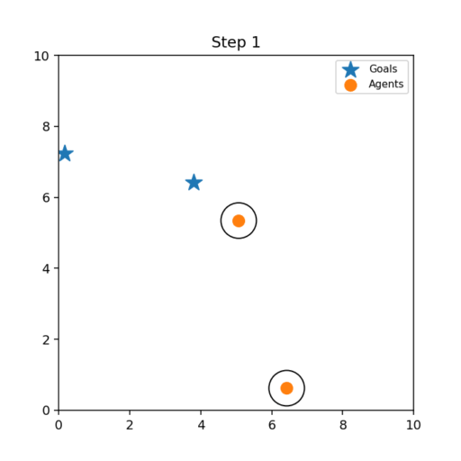

# 2D Multi-Agent Navigation with an MPC Safety Filter

A compact, reproducible project for **multi-agent navigation** in a 2D square world.  
Each agent learns a PPO policy to reach its own goal. A tiny **MPC-style safety filter** projects proposed actions to avoid collisions. We compare **baseline** vs **filtered** training on collisions and success.

**License:** MIT

---

## Table of Contents
- [Features](#features)
- [Project Structure](#project-structure)
- [Installation](#installation)
- [Quickstart](#quickstart)
- [Visualization (Live Simulation)](#visualization-live-simulation)
- [Environment Details](#environment-details)
- [MPC Safety Filter (QP)](#mpc-safety-filter-qp)
- [Tips to Increase Success Rate](#tips-to-increase-success-rate)
- [Troubleshooting](#troubleshooting)
- [Development](#development)
- [Citation](#citation)
- [Acknowledgements](#acknowledgements)

---

## Features

- **Gym-style environment** with *N* point-mass agents in a shared square.
- **Independent PPO** per agent (can easily switch to a **shared policy**).
- **MPC safety filter**: one-step **convex QP** with optional **slacks** for feasibility.
- **Reward shaping**: progress toward goal + one-time goal bonus; reached agents can be frozen.
- **Metrics**: collisions/episode, success (all goals reached), time-to-goal (steps), return.
- **Windows-friendly** setup (tested with `cvxpy` + `osqp` in a venv).
- **Live visualization** to watch agents, goals, and (potential) collisions in real time.

---

## Project Structure

2d-multiagent-mpc-filter/
├─ src/
│ ├─ env.py # MultiAgentEnv (Gym-style)
│ ├─ agents/
│ │ ├─ init.py
│ │ └─ ppo_agent.py # Actor–Critic (continuous 2D)
│ ├─ filter/
│ │ ├─ init.py
│ │ └─ mpc_filter.py # QP safety projection (+ optional slacks)
│ ├─ train_baseline.py # PPO without safety filter
│ ├─ train_with_filter.py # PPO with MPC safety filter
│ └─ visualize.py # ← Live graphical simulation (Matplotlib)
├─ tests/
│ └─ test_env.py # minimal sanity checks
├─ requirements.txt
├─ setup.py # optional: pip install -e .
├─ .github/workflows/ci.yml # optional: GitHub Actions (pytest)
└─ LICENSE # MIT


---

### Baseline


### Filtered (MPC safety)


---

## Installation

> **Windows PowerShell / VS Code terminal example**

```powershell
git clone <YOUR_REPO_URL>
cd 2d-multiagent-mpc-filter

python -m venv venv
.\venv\Scripts\Activate

python -m pip install --upgrade pip wheel setuptools
pip install -r requirements.txt
# Optional (for clean imports across scripts/notebooks):
pip install -e .
```

Verify cvxpy solvers:
python -c "import cvxpy as cp; print(cp.installed_solvers())"
# Expect to see OSQP in the list; if not:
pip install osqp


Quickstart

Baseline (no filter):
python src/train_baseline.py --n-agents 2 --episodes 50 --horizon 300

With MPC filter:
python src/train_with_filter.py --n-agents 2 --episodes 50 --horizon 300

Recommended flags (to make finishing easier):
# add to either command if supported by your scripts
--grid-size 10 --dt 0.2 --radius 0.5 --epochs 8 --lr 1e-4

Saving checkpoints (optional, for visualization):
At the end of each train script, save weights:
import os, torch
os.makedirs("checkpoints", exist_ok=True)
for i, net in enumerate(nets):
    torch.save(net.state_dict(), f"checkpoints/<baseline_or_filtered>_final_agent{i}.pt")

Visualization (Live Simulation)
The src/visualize.py script shows agents (colored circles), goals (X markers), and a HUD with step, cumulative collisions, and how many agents reached.

Run examples:
# Random actions (smoke test)
python src/visualize.py --mode random --n-agents 2 --horizon 300

# Random actions WITH safety filter
python src/visualize.py --mode random --filter --n-agents 2 --horizon 300

# Trained policies (load latest checkpoints)
python src/visualize.py --mode policy --load-dir checkpoints --n-agents 2 --horizon 300

# Trained policies WITH safety filter
python src/visualize.py --mode policy --filter --load-dir checkpoints --n-agents 2 --horizon 300

# Easier finishing for demo
python src/visualize.py --mode policy --filter --load-dir checkpoints --dt 0.2 --goal-threshold 0.35 --horizon 300

Key flags:

--mode {random,policy}: random actions or use PPO Actor–Critic networks

--filter: apply the MPC safety filter before stepping the env

--load-dir: directory with saved *.pt weights (policy mode)

--goal-threshold: distance for rendering “reached” (display only)

--dt, --radius, --grid-size, --horizon: override env settings


------------------------

Environment Details
State: concatenation of all agent positions and all goals
[p1x, p1y, p2x, p2y, ..., g1x, g1y, g2x, g2y, ...]

Action: per-agent 2D velocity; env clips to bounds, then
pos ← clamp(pos + dt * action, 0, grid_size)

Reward shaping (typical):

Progress: k * (prev_dist − dist) (positive if moving closer)

Step cost: small negative (e.g., −0.02)

Collision penalty if two agents are closer than 2*radius

One-time goal bonus when dist < threshold (e.g., +100 at 0.3)

Freeze reached agents (optional) to avoid jitter/collisions

Episode ends when all agents reach their goals or max_steps is hit.


------------------------------

MPC Safety Filter (QP)
At each step we solve:

Objective:
minimize ‖u − u_prop‖² + λ * Σ s_ij²

Subject to (for every pair i<j):
(p_i − p_j)ᵀ (u_i − u_j) ≥ (d_min² − ‖p_i − p_j‖²)/dt − s_ij
-u_max ≤ u ≤ u_max and s_ij ≥ 0

u_prop: policy’s proposed actions

u: filtered actions

p_i: current positions

d_min = 2*radius + ε safety margin

s_ij: non-negative slack (large λ discourages violations)

Solvers: OSQP preferred, with CLARABEL/SCS/ECOS fallbacks.

This is a fast, always-feasible projection that nudges agents away from imminent collision while staying close to the policy’s intent.


--------------------------------------

Tips to Increase Success Rate
Speed & threshold: use --dt 0.2 and a reach threshold of 0.3–0.4.

Team bonus: give a one-time bonus when all agents reach (coordination).

Boost the laggard: once one agent has reached, up-weight progress for the others.

Shared policy: a single Actor–Critic for all agents (shared weights) often coordinates better.

Normalize observations: divide inputs by grid_size before feeding the network.

Curriculum: start with grid_size=5, dt=0.2, n_agents=2, optionally spawn goals near starts, then scale up.


----------------------------------------

Development
Run tests:
pytest -q

Editable install:
pip install -e .

Continuous Integration (optional):

.github/workflows/ci.yml runs pytest on push/PR for reproducibility.

Packaging (optional):

setup.py allows pip install -e . and later PyPI packaging if desired.


----------------------------------------

Citation
If you use this project in academic work or demos, please consider citing the repository:

@misc{2d-multiagent-mpc-filter,
  title  = {2D Multi-Agent Navigation with an MPC Safety Filter},
  author = {Your Name},
  year   = {2025},
  url    = {https://github.com/<your-username>/2d-multiagent-mpc-filter}
}


-------------------------------------------

**License:** MIT — see [LICENSE](LICENSE).
